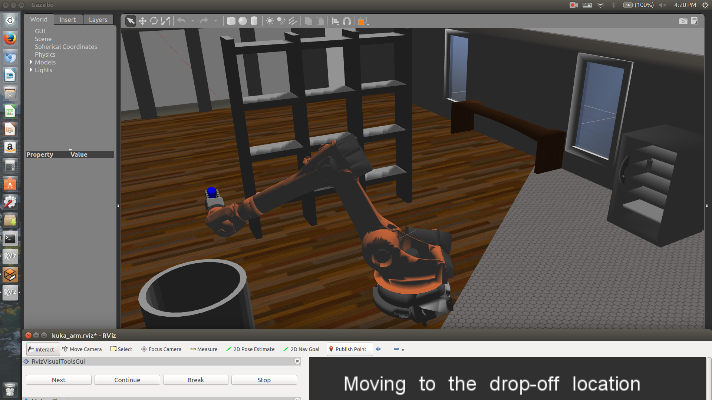

# RoboND - KUKA KR210
Jun Zhu

---



## Preparations

#### Enviroment setup
```
# this needs to be done whenever you open a new terminal
source /opt/ros/kinetic/setup.bash

# To save the effort, one can do
echo 'source /opt/ros/kinetic/setup.bash' >> ~/.bashrc

# Then we can see some information from the following command
printenv | grep ROS
```

#### Upgrade gazebo

```
gazebo --version
# 7.7.0+ is required for this project
sudo sh -c 'echo "deb http://packages.osrfoundation.org/gazebo/ubuntu-stable `lsb_release -cs` main" > /etc/apt/sources.list.d/gazebo-stable.list'
wget http://packages.osrfoundation.org/gazebo.key -O - | sudo apt-key add -
sudo apt-get update
sudo apt-get install gazebo7

```

#### Create a catkin work space

```
mkdir -p <root directory>/catkin_ws/src
cd <root directory>/catkin_ws/
catkin_make
```

#### Install dependencies

```
# clone the project

cd <root directory>/catkin_ws/
rosdep install --from-paths src --ignore-src --rosdistro=kinetic -y
```

#### Build the project

```
cd <root directory>/catkin_ws/

catkin_make

# if you get:
# fatal error: ignition/math/Inertial.hh: No such file or directory, then install the following library and re-build
sudo apt-get install libignition-math2
```

#### For each start, one needs to type the following 

```
export GAZEBO_MODEL_PATH=<root directory>/catkin_ws/src/RoboND-KUKA-KR210/kuka_arm/models

source <root directory>/catkin_ws/devel/setup.bash

# to save the effort push them into your ~/.bashrc
```

#### Bugs

To ensure the gripper grasps the target before it retriets, add a line

```
ros::Duration(5.0).sleep();
```

at line 327 in the file [trajectory_sampler.cpp](kuka_arm/src/trajectory_sampler.cpp)

__But there is still a small chance that the gripper failed to grasp the target!__


## Kinematic analysis

For details, please check [kinematics_solution.ipynb](kinematics_solution.ipynb).


## Demonstration

__Success 12/12__

[](https://youtu.be/aKXPpqryq6I)

  
  
 
 
 
 
